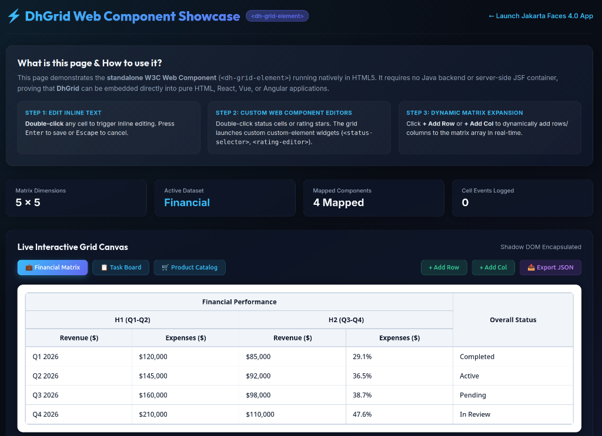

# ⚡ DhGrid — High-Performance Data Grid Component for Jakarta Faces 4.0 & W3C Web Components

[](releases/1.0.0-gamma.md)
[](https://jakarta.ee/specifications/faces/4.0/)
[](https://developer.mozilla.org/en-US/docs/Web/API/Web_components)
[](LICENSE)
[](pom.xml)
[](https://dadhawk-dev.github.io/dh-grid/)

**DhGrid** is an open-source, lightweight, ultra-fast, zero-dependency data grid component designed for both **Jakarta EE / Jakarta Faces 4.0 (JSF)** applications and pure **W3C Web Components (`<dh-grid-element>`)**.

It features intuitive inline editing, custom Web Component editor widgets (`<status-selector>`, `<rating-editor>`, `<priority-badge-editor>`), real-time reactive event streams, dynamic matrix expansion, **Composite Parent-Child Tree Captions**, **Cell ReadOnly Control**, **Dynamic Cell Styling Strategies**, and **PrimeFaces Theme Compatibility**.

> 🌐 **Interactive Online Showcase**: Want to test DhGrid live right now in your browser?  
> 👉 **[Click here to open the Interactive Live Demo Page](https://dadhawk-dev.github.io/dh-grid/)** (or click the preview image below) to explore live inline editing, custom editor widgets, tree headers, and live-editable code execution!

[](https://dadhawk-dev.github.io/dh-grid/)

---

## 🌟 Key Features & Highlights

- 🌐 **Interactive Live Demo Showcase**: Click **[https://dadhawk-dev.github.io/dh-grid/](https://dadhawk-dev.github.io/dh-grid/)** to experience all grid features, preset datasets, and live code runners directly in your browser.
- 🎨 **PrimeFaces Theme Compatibility (`css-compatible="primethemes"`)**: Seamlessly binds Shadow DOM table styles (`--dh-table-bg`, `--dh-border-color`, `--dh-cell-color`) to active PrimeFaces CSS variables (`--surface-a`, `--surface-border`, `--text-color`, `--primary-color`).
- 🌳 **Composite Parent-Child Tree Captions**: Define multi-level hierarchical headers compactly using path notation (`"Sales / H1 / Q1"`, `"Sales / H1 / Q2"`), 2D arrays, or nested tree objects.
- 🔒 **Cell ReadOnly Control (`readOnly`, `readOnlyCells`)**: Global grid locking or per-cell / per-column read-only rule maps with lock-shake animation feedback.
- 🎨 **Dynamic Cell Styling Strategy (`cellStyles`)**: Custom background colors, text colors, and font styles per cell, column, or row using shorthand objects or CSS rule strings.
- 🧩 **Custom Web Component Cell Editors**: Map custom interactive widgets (`<status-selector>`, `<rating-editor>`) directly to grid cells via simple `componentMap` JSON.
- ⚡ **Zero External JS Dependencies**: Fully encapsulated inside Shadow DOM with native performance, zero external framework locks.
- ☕ **Native Jakarta Faces 4.0 JSF Integration**: Drop-in `<dh:dhGrid>` Facelets tag library with direct EL expression binding (`#{gridBean.content}`, `#{gridBean.readOnlyCells}`, `#{gridBean.cellStyles}`, `#{gridBean.cssCompatible}`).
- 📡 **Real-Time Reactive Event System**: Emits composed `cell-change` CustomEvents for instant client-side or server-side reactive sync.

---

## 📦 Quick Installation & Setup

### 🅰️ Method 1: GitHub Pages Maven Repository (Recommended)

Add the GitHub Pages Maven Repository to your project's `pom.xml` to automatically download `dhgrid-component-1.0.0.jar` (no manual CLI commands required!):

```xml
<repositories>
    <repository>
        <id>dadhawk-dhgrid-repo</id>
        <name>DhGrid GitHub Maven Repository</name>
        <url>https://dadhawk-dev.github.io/dh-grid/maven-repo/</url>
    </repository>
</repositories>

<dependencies>
    <dependency>
        <groupId>com.dadhawk.faces</groupId>
        <artifactId>dhgrid-component</artifactId>
        <version>1.0.0</version> <!-- or 1.0.0-beta -->
    </dependency>
</dependencies>
```

---

### 🅱️ Method 2: Direct JAR Download & Local Maven Install (`~/.m2`)

> 📦 **Direct Download**: **[Download Maven JAR v1.0.0 (`dhgrid-component-1.0.0.jar`)](https://dadhawk-dev.github.io/dh-grid/downloads/dhgrid-component-1.0.0.jar)**

If you downloaded the JAR manually, install it to your local Maven repository:

```bash
mvn install:install-file \
  -Dfile=dhgrid-component-1.0.0.jar \
  -DgroupId=com.dadhawk.faces \
  -DartifactId=dhgrid-component \
  -Dversion=1.0.0 \
  -Dpackaging=jar
```

---

## 💡 Quick-Start Developer Examples

> 💡 **Try it live in your browser!** Click **[▶ Open Interactive Live Demo Showcase Page](https://dadhawk-dev.github.io/dh-grid/)** to test and edit these code snippets live in an interactive web application!

### 🅰️ Vanilla JavaScript (Pure HTML5 + Web Components) &nbsp; [](https://dadhawk-dev.github.io/dh-grid/)

```html
<!DOCTYPE html>
<html lang="en">
<head>
  <script src="resources/dadhawk/js/dh-grid.js"></script>
  <script src="resources/js/custom-editors.js"></script>
</head>
<body>
  <!-- 1. Embedded Web Component (Declarative HTML Attributes) -->
  <dh-grid-element id="myGrid"
                   rows="5"
                   cols="5"
                   readonly="false"
                   readonly-cells='{"r1_c0": true, "r3": true}'
                   cell-styles='{"r1_c3": "background-color: rgba(34, 197, 94, 0.15); color: #15803d; font-weight: 700;", "c1": "color: #0284c7; font-weight: 600;"}'>
  </dh-grid-element>

  <script>
    const grid = document.getElementById('myGrid');

    // 2. Define Composite Parent-Child Tree Captions
    grid.setAttribute('captions', JSON.stringify([
      "Financial Performance / H1 (Q1-Q2) / Revenue ($)",
      "Financial Performance / H1 (Q1-Q2) / Expenses ($)",
      "Financial Performance / H2 (Q3-Q4) / Revenue ($)",
      "Financial Performance / H2 (Q3-Q4) / Expenses ($)",
      "Overall Status"
    ]));

    // 3. Populate Grid Content Matrix
    grid.setAttribute('content', JSON.stringify([
      ["Quarter", "Revenue ($)", "Expenses ($)", "Margin (%)", "Performance"],
      ["Q1 2026", "$120,000", "$85,000", "29.1%", "Completed"],
      ["Q2 2026", "$145,000", "$92,000", "36.5%", "Active"],
      ["Q3 2026", "$160,000", "$98,000", "38.7%", "Pending"],
      ["Q4 2026", "$210,000", "$110,000", "47.6%", "In Review"]
    ]));

    // 4. Map Custom Web Component Editors to Specific Cells
    grid.setAttribute('components', JSON.stringify({
      "r1_c4": "status-selector",
      "r2_c4": "status-selector",
      "r3_c4": "status-selector",
      "r4_c4": "status-selector"
    }));

    // 5. Configure Cell ReadOnly Rules & Custom Styling (Imperative JS Property API)
    // Note: {"r1_c0": true} locks single cell; {"r3": true} locks entire row 3; {"c0": true} locks column 0.
    grid.readOnlyCells = { "r1_c0": true, "r3": true };
    // Note: {"r1_c3": "..."} styles single cell; {"c1": "..."} styles entire column 1; {"r2": "..."} styles row 2.
    grid.cellStyles = {
      "r1_c3": "background-color: rgba(34, 197, 94, 0.15); color: #15803d; font-weight: 700;",
      "c1": "color: #0284c7; font-weight: 600;"
    };

    // 6. Listen for Cell Change Events
    grid.addEventListener('cell-change', (e) => {
      console.log(`Row ${e.detail.row}, Col ${e.detail.col} updated -> "${e.detail.value}"`);
    });
  </script>
</body>
</html>
```

---

### 🅱️ Jakarta Faces 4.0 (JSF View + Managed Bean)

#### Facelets View (`index.xhtml`)

```xml
<!DOCTYPE html>
<html xmlns="http://www.w3.org/1999/xhtml"
      xmlns:h="jakarta.faces.html"
      xmlns:dh="http://dadhawk.com/faces">
<h:head>
    <title>Jakarta Faces 4.0 DhGrid Showcase</title>
</h:head>
<h:body>
    <h:form id="gridForm">
        <dh:dhGrid id="myGrid"
                   rowCount="#{gridBean.rowCount}"
                   colCount="#{gridBean.colCount}"
                   content="#{gridBean.content}"
                   captions="#{gridBean.captions}"
                   componentMap="#{gridBean.componentMap}"
                   readOnlyCells="#{gridBean.readOnlyCells}"
                   cellStyles="#{gridBean.cellStyles}" />
    </h:form>
</h:body>
</html>
```

#### CDI Managed Bean (`GridBean.java`)

```java
package com.dadhawk.faces.demo;

import jakarta.annotation.PostConstruct;
import jakarta.enterprise.context.SessionScoped;
import jakarta.inject.Named;
import java.io.Serializable;
import java.util.Map;

@Named("gridBean")
@SessionScoped
public class GridBean implements Serializable {

    private Integer rowCount = 5;
    private Integer colCount = 5;
    private String[][] content;
    private Object captions;
    private Map<String, String> componentMap;
    private Object readOnlyCells;
    private Object cellStyles;

    @PostConstruct
    public void init() {
        this.captions = new String[] {
            "Financial Performance / H1 / Revenue ($)",
            "Financial Performance / H1 / Expenses ($)",
            "Financial Performance / H2 / Revenue ($)",
            "Financial Performance / H2 / Expenses ($)",
            "Overall Status"
        };
        this.content = new String[][] {
            {"Quarter", "Revenue ($)", "Expenses ($)", "Margin (%)", "Performance"},
            {"Q1 2026", "$120,000", "$85,000", "29.1%", "Completed"},
            {"Q2 2026", "$145,000", "$92,000", "36.5%", "Active"}
        };
        this.componentMap = Map.of(
            "r1_c4", "status-selector",
            "r2_c4", "status-selector"
        );
        this.readOnlyCells = Map.of("r1_c0", true, "r2_c0", true);
        this.cellStyles = Map.of(
            "r1_c3", "background-color: rgba(34, 197, 94, 0.15); color: #15803d; font-weight: 700;",
            "r2_c3", "background-color: rgba(34, 197, 94, 0.15); color: #15803d; font-weight: 700;"
        );
    }

    public Integer getRowCount() { return rowCount; }
    public Integer getColCount() { return colCount; }
    public String[][] getContent() { return content; }
    public Object getCaptions() { return captions; }
    public Map<String, String> getComponentMap() { return componentMap; }
    public Object getReadOnlyCells() { return readOnlyCells; }
    public Object getCellStyles() { return cellStyles; }
}
```

---

### 🔀 Minimal Feature Usage Snippets (`v1.0.0-beta`)

#### 🔒 1. Cell ReadOnly Control (`readOnly`, `readOnlyCells`)
Lock all cells globally (`readOnly="true"`) or configure per-cell/per-column read-only rule maps:

```html
<!-- W3C Web Component (Pure HTML5) -->
<!-- Lock single cell ("r1_c0"), entire row ("r3"), or entire column ("c0") -->
<dh-grid-element id="myGrid"
                 readonly-cells='{"r1_c0": true, "r3": true, "c0": true}'>
</dh-grid-element>
```

```xml
<!-- Jakarta Faces 4.0 Taglib (Facelets View) -->
<dh:dhGrid id="myGrid"
           readOnly="false"
           readOnlyCells="#{gridBean.readOnlyCells}" />
```

#### 🎨 2. Dynamic Cell Styling Strategy (`cellStyles`)
Apply custom background colors, text colors, and font styles per cell, column, or row using inline CSS strings or JSON objects:

```html
<!-- W3C Web Component (Pure HTML5) -->
<!-- Style single cell ("r1_c3"), entire column ("c1"), or entire row ("r2") -->
<dh-grid-element id="myGrid"
                 cell-styles='{"r1_c3": "background-color: rgba(34, 197, 94, 0.15); color: #4ade80; font-weight: 700;", "c1": "color: #38bdf8; font-weight: 600;", "r2": "background: rgba(99, 102, 241, 0.1);"}'>
</dh-grid-element>
```

```xml
<!-- Jakarta Faces 4.0 Taglib (Facelets View) -->
<dh:dhGrid id="myGrid"
           cellStyles="#{gridBean.cellStyles}" />
```

---

## 🛠️ CLI Quick Start Commands

```bash
# Build component library & install to ~/.m2
mvn clean install

# Launch Jetty 11 server (Jakarta Faces 4.0 runtime)
cd demo
mvn jetty:run
```

Access local endpoints:
- **Jakarta Faces 4.0 Showcase**: `http://localhost:8085/index.xhtml`
- **Standalone Web Component Showcase**: `http://localhost:8085/standalone-demo.html`

---

## 🏷️ Release History & Tags

- **`v1.0.0-gamma`** ([Release Notes](releases/1.0.0-gamma.md)):
  - Added **PrimeFaces Theme Compatibility** (`css-compatible="primethemes"` / `cssCompatible="primethemes"`).
  - Direct CSS variable binding between Shadow DOM host element and PrimeThemes variables (`--surface-a`, `--surface-b`, `--surface-border`, `--text-color`, `--primary-color`).
  - Added live PrimeThemes theme switcher toolbar in interactive showcase.
- **`v1.0.0-beta`** ([Release Notes](releases/1.0.0-beta.md)):
  - Added **Cell ReadOnly Strategy** (`readOnly`, `readOnlyCells`) with lock-shake animation feedback.
  - Added **Dynamic Cell Styling Strategy** (`cellStyles`) supporting per-cell/column background, text colors, and font styles.
  - Expanded Jakarta Faces 4.0 `<dh:dhGrid>` taglib attributes with full EL binding support.
- **`v1.0.0-alpha`** ([Release Notes](releases/1.0.0-alpha.md)):
  - Initial open-source release under GNU LGPL v3.0 by Telman Shahbazov / Dadhawk.
  - Dual-mode architecture: Jakarta Faces 4.0 `<dh:dhGrid>` taglib component & native W3C `<dh-grid-element>`.
  - Composite parent-child tree captions with automated `colspan`/`rowspan` matrix calculation.
  - Custom Web Component cell editors (`<status-selector>`, `<rating-editor>`).
  - Interactive live demo preview modal.

---

## 🏷️ GitHub Topics & SEO Tags

`#jakarta-faces` `#jsf` `#web-components` `#grid-component` `#datagrid` `#java` `#jakarta-ee` `#handsontable-alternative` `#web-component` `#ui-components` `#custom-elements` `#facelets` `#component-library` `#shadow-dom`

---

## 📄 License

Distributed under the **GNU Lesser General Public License v3.0 (LGPL v3.0)**. See `LICENSE` for details.

Developed with ❤️ by **Telman Shahbazov / Dadhawk** with **Google DeepMind Antigravity AI** ([https://github.com/dadhawk-dev](https://github.com/dadhawk-dev)).
